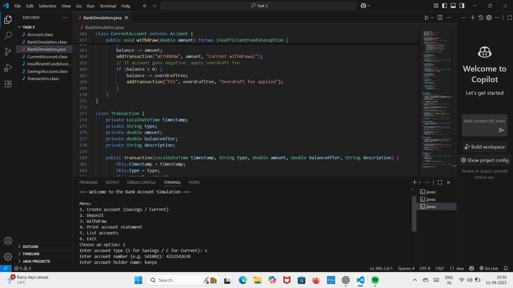

# Bank Account Simulation - Java

## 📌 Overview
This is a **simple Java program** to simulate basic **bank account operations** like depositing money, withdrawing money, and checking the balance.  
The code is beginner-friendly and easy to understand.

---

## ✨ Features
- Create a bank account with an initial balance.
- Deposit money into the account.
- Withdraw money from the account (with balance check).
- Display the current balance.
- Simple menu-driven console program.

---
## 🖼 Screenshot  


## 🛠 Technologies Used
- Java (Core Concepts)
- OOP (Object-Oriented Programming)
- Scanner Class for Input

 


---

## 📂 Repository
🔗 [GitHub Repo Link](https://github.com/sudhatanmai/bank-account-simulation-java/tree/main)

---

## 👨‍💻 Author
**Sudha Tanmai**

---

## 📝 How to Run
1. Clone the repository:
   ```bash
   git clone https://github.com/sudhatanmai/bank-account-simulation-java.git
